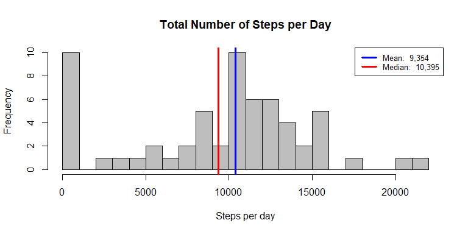
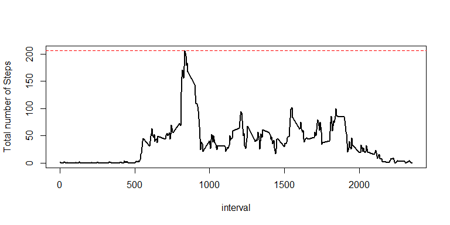
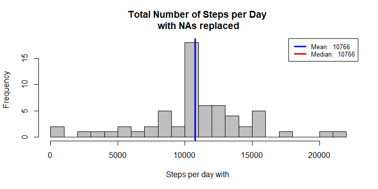

## Loading and preprocessing the data

This assignment makes use of data from a personal activity monitoring device. This device collects data at 5 minute intervals through out the day. The data consists of two months of data from an anonymous individual collected during the months of October and November, 2012 and include the number of steps taken in 5 minute intervals each day.

The data for this assignment can be downloaded from the course web site:

https://d396qusza40orc.cloudfront.net/repdata%2Fdata%2Factivity.zip


The variables included in this dataset are:

1. steps: Number of steps taking in a 5-minute interval (missing values are coded as NA )
1. date: The date on which the measurement was taken in YYYY-MM-DD format
1. interval: Identifier for the 5-minute interval in which measurement was taken


```r
#The first section of code downloads the file if not present and loads the data into raw data
filename <- "activity.zip"

## Download and unzip the dataset:
if (!file.exists(filename)){
fileURL <- "https://d396qusza40orc.cloudfront.net/repdata%2Fdata%2Factivity.zip"
download.file(fileURL, filename, method="curl")
unzip(filename)
}
#read to raw data
raw_data <- read.csv("activity.csv")


#the first section of processing summarises the data as total by day and average for each interval over the day
library(dplyr)
dailysteps<- raw_data %>% group_by(date) %>% summarise(totalSteps =sum(steps,na.rm=TRUE))  
steps_by_interval<- raw_data %>% group_by(interval) %>% summarise(meanSteps =mean(steps,na.rm=TRUE))  

number_of_days <- nrow(dailysteps)
number_of_intervals <- nrow(steps_by_interval)
```


## What is mean total number of steps taken per day?
Below is a histogram of the daily steps for the 61 days in the study. Mean and median are shown on the graph

### Observations

* Number of zero step days to be investigated
* Mean and median close showing low skew in the data


```r
with(dailysteps,hist(totalSteps,breaks=30,col="grey",xlab ="Steps per day",main="Total Number of Steps per Day"))
abline(v=mean(dailysteps$totalSteps),lwd=3,col="red")
abline(v=median(dailysteps$totalSteps,na.rm=TRUE),lwd=3,col="blue")

legend('topright', lty = 1, lwd = 3, col = c("blue", "red"),
               cex = .8, 
               legend = c(paste('Mean: ', formatC(round(mean(dailysteps$totalSteps),0),big.mark = ",")),
               paste('Median: ', formatC(median(dailysteps$totalSteps),big.mark = ",")))
               )
```

<!-- -->

## What is the average daily activity pattern?

A graph of the average activity level for each of the 288 5 minute intervals over the days


```r
#graph the average steps per interval
with(steps_by_interval,plot(interval,meanSteps,type="l",lwd=2,ylab="Total number of Steps"))

#Work ou the highest activity level over the day and calculate the slice
max <- max(steps_by_interval$meanSteps)
max_interval <- steps_by_interval$interval[steps_by_interval$meanSteps==max]
max_round <- round(max,1)

#show the max level on the graph
abline(h=max,col="red",lty=2,lwd=1)
```

<!-- -->
<br>**The max value is at 206.2 at interval 835**


## Imputing missing values
The data contains a number of missing steps values for intervals. This analysis fills these in with the average for that interval on other days


```r
print(paste("Total number of missing steps is",formatC(sum(is.na(raw_data$steps)),big.mark=",")))
```

```
## [1] "Total number of missing steps is 2,304"
```

```r
data <- raw_data
data$oldsteps <-data$steps

data <- merge(data,steps_by_interval,by="interval")
data$steps[is.na(data$steps)] <- data$meanSteps[is.na(data$steps)]
newdailysteps<- data %>% group_by(date) %>% summarise(totalSteps =sum(steps,na.rm=TRUE))  
```

Graphing the data with the gaps filled in gives the same mean and median


```r
with(newdailysteps,hist(totalSteps,breaks=30,col="grey",xlab ="Steps per day with ",main="Total Number of Steps per Day \nwith NAs replaced"))
abline(v=mean(newdailysteps$totalSteps),lwd=3,col="red")
abline(v=median(newdailysteps$totalSteps,na.rm=TRUE),lwd=3,col="blue")

legend('topright', lty = 1, lwd = 3, col = c("blue", "red"),
               cex = .8, 
               legend = c(paste('Mean: ', round(mean(newdailysteps$totalSteps),0)),
               paste('Median: ', round(median(newdailysteps$totalSteps),0)))
               )
```

<!-- -->


## Are there differences in activity patterns between weekdays and weekends?
